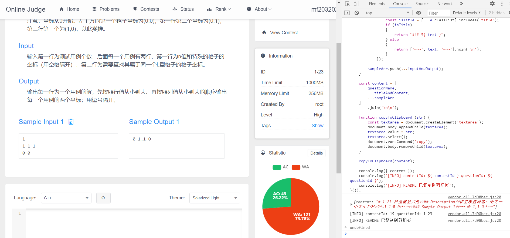

# advanced_algorithm

高级算法 oj 代码归档

## 说明

### readmeCreator `readme 生成脚本`

在题目页面下运行 [readmeCreator.js](readmeCreator.js) 脚本，控制台会打印 `contestId` 和 `questionId` `，并将生成的README内容复制进粘贴板。

### folderCreator `folder 生成脚本`

运行 [folderCreator.js](folderCreator.js) 脚本，依次输入参数：

* contestId （如 19）；

* questionId （如1-10）。

~~~
node .\advanced_algorithm\folderCreator.js 19 1-10
~~~

即可在对应的 contest 文件夹下新建对应的 question 文件夹，并将 template 目录下的模板文件 [Main.js](template/Main.java) 复制到该文件夹下，并生成空的 README 文件。